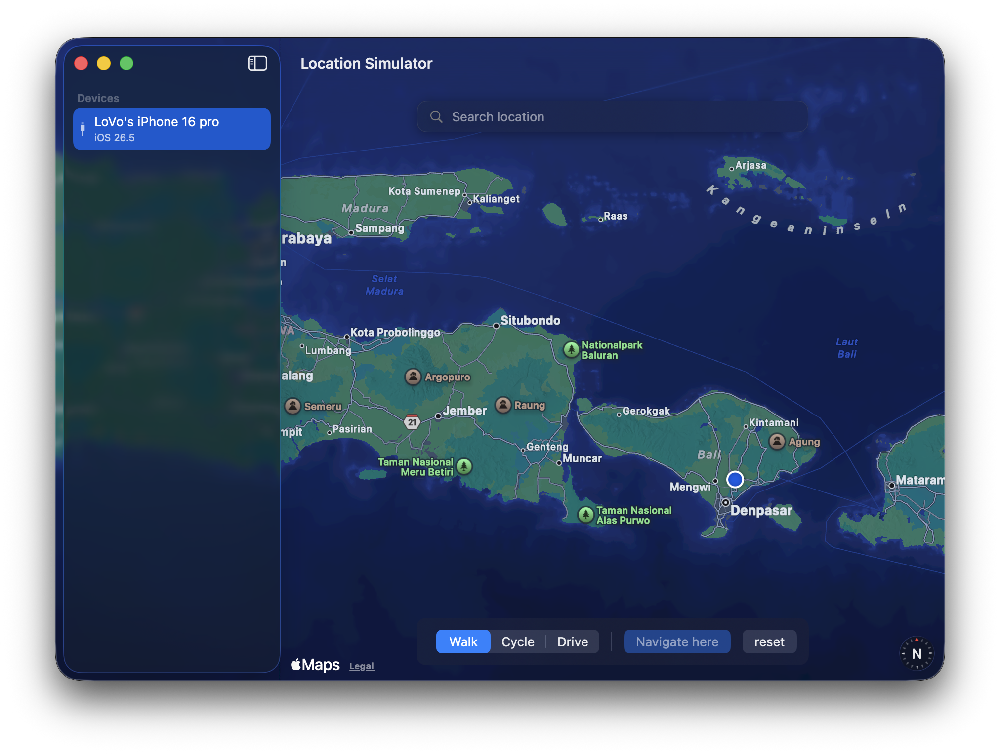
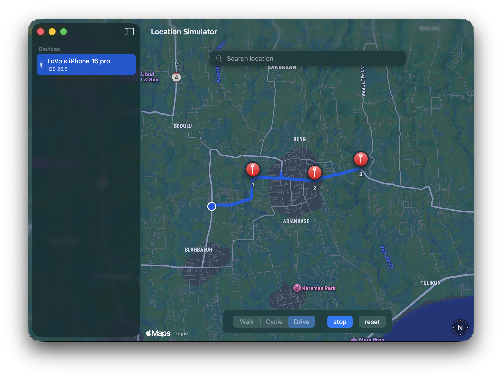

<h1 align="center">Location Simulator</h1>

<p align="center">
  Spoof the GPS location of a connected iPhone from your Mac.
  Set a fixed location or move along a route at a chosen speed.
</p>

<p align="center">
  <a href="https://www.gnu.org/licenses/gpl-3.0"></a>
  
  
  
</p>

<p align="center">
  
  
</p>

> **Disclaimer.** This is a developer tool for testing location-aware apps against a real
> device. Don't use it to cheat in games or to deceive other people or services.

---

## Why this exists

The established tool for this is
[Schlaubischlump/LocationSimulator](https://github.com/Schlaubischlump/LocationSimulator).
Its device backend stops at **iOS 16**. On iOS 17 and later, Apple moved device services
behind an RSD tunnel that the old approach does not speak.

This project is a clean rebuild on a current stack, with a backend that works on **iOS 17,
18, and 26**: a SwiftUI app driving [`go-ios`](https://github.com/danielpaulus/go-ios) over a
userspace tunnel, no root required. Both upstream projects are credited below.

## Features

- **Teleport**: search for a place or click the map to set a fixed location.
- **Navigate**: drop waypoints and move along the route at walk, cycle, or drive speed, with live route rendering.
- **Location search**: live autocomplete; pick a result to move the map there.
- **Real iOS 17+ devices**: userspace tunnel, automatic DeveloperDiskImage mount.

## Requirements

- **macOS 26+** on Apple Silicon
- **Xcode 26** (Swift 6)
- [XcodeGen](https://github.com/yonaskolb/XcodeGen): `brew install xcodegen`
- [go-ios](https://github.com/danielpaulus/go-ios): `go install github.com/danielpaulus/go-ios@latest`
  (see [All-in-one](#all-in-one-bundled-go-ios) to skip this)
- A paired iPhone or iPad on **iOS 17+** with **Developer Mode** enabled

## Build and run

```sh
git clone git@github.com:Eirias/iPhone-LocationSimulator.git
cd iPhone-LocationSimulator
xcodegen generate          # generates LocationSimulator.xcodeproj from project.yml
open LocationSimulator.xcodeproj
# build and run the "LocationSimulator" scheme in Xcode
```

Connect a device, select it in the sidebar, and spoof.

> `project.yml` is the source of truth. The `.xcodeproj` is generated and should not be
> hand-edited.

### All-in-one (bundled go-ios)

`main` resolves `go-ios` from a system install (`~/go/bin`, Homebrew, `/usr/local`). To avoid
installing it separately, use the **`feature/all-in-one`** branch. It bundles the `go-ios`
binary inside the app (extracted and made executable on first launch), so building the app is
all you need.

> The bundled binary is **arm64-only** (~30 MB). For Intel or Universal, drop in a `lipo`-merged
> `go-ios`. A signed build also requires signing the embedded binary.

## How it works

A SwiftUI app on top of modular Swift packages:

```
App/                      # @main entry, root view
Packages/
├── Features/             # MapFeature, SidebarFeature (SwiftUI views)
├── State/AppStore/       # AppState, AppEvent, AppReducer, AppMiddleware (the store)
├── Interface/            # SpooferInterface (the backend contract)
└── Other/
    ├── Services/         # SpooferService (live), GoIOSKit (go-ios wrapper)
    ├── Models, Core, DesignSystem, Localization
```

The spoofing backend (`GoIOSKit` + `SpooferService`):

1. **Tunnel**: starts `go-ios tunnel start --userspace` and reaps stale go-ios processes
   first, so a force-killed previous run cannot block the shared port.
2. **DeveloperDiskImage**: auto-mounted via go-ios for the device's iOS version.
3. **Teleport**: `go-ios setlocation` (go-ios auto-discovers the tunnel), held open to keep
   the location applied.
4. **Navigate**: interpolates the route and steps `setlocation` point by point at the chosen
   speed, cancellable at any time.

### DeveloperDiskImage and legal note

Spoofing a real device needs Apple's per-version `DeveloperDiskImage`. This app does **not**
bundle Apple's images; `go-ios` fetches and mounts what is needed at runtime. Enable
**Developer Mode** on the device (Settings > Privacy & Security > Developer Mode).

## Credits

- [Schlaubischlump/LocationSimulator](https://github.com/Schlaubischlump/LocationSimulator):
  the original app and the basis for this rebuild (GPLv3).
- [danielpaulus/go-ios](https://github.com/danielpaulus/go-ios): the iOS 17+ device backend (MIT).

Full third-party attributions are in [`NOTICE`](NOTICE).

## License

[GPLv3](LICENSE). See [`NOTICE`](NOTICE) for third-party licenses.
